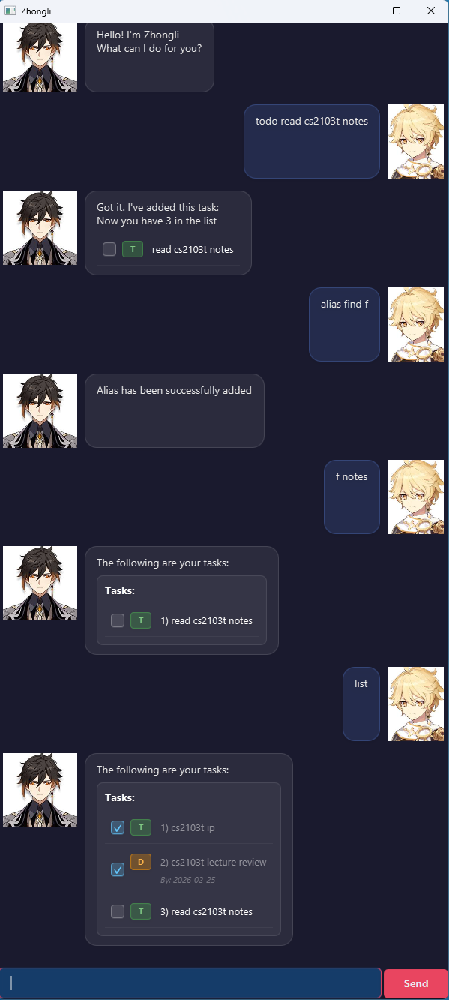
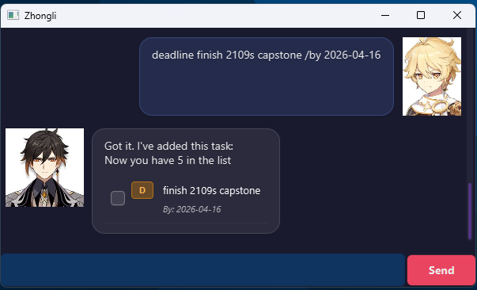
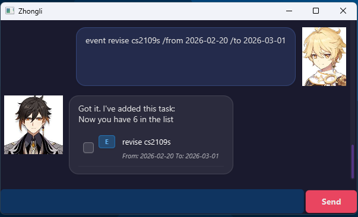
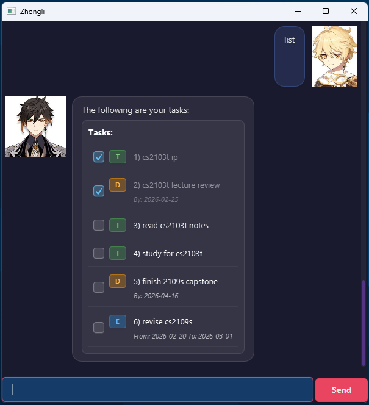
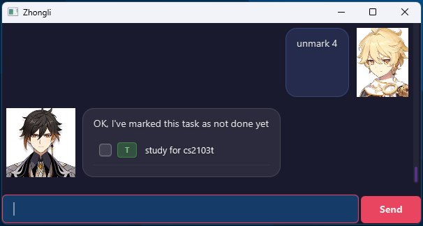
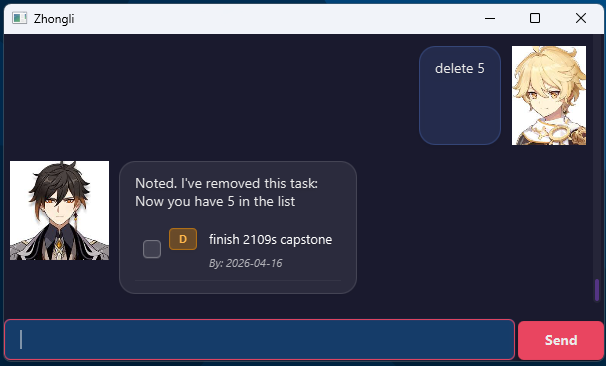
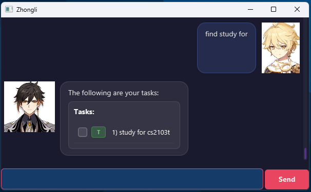
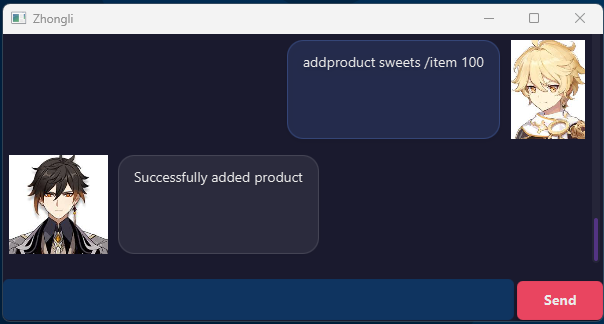

# Zhongli User Guide

 

> Free your mind with Zhongli.

Zhongli is a *simple* command line task tracker. Its
- Text Based
- ~~Difficult~~ Easy to use
- **VERY FAST** to use
  
To install, just follow these 5 steps:
1. Ensure you have Java 17 installed on your laptop / computer
2. Download the latest `.jar` file from <here>
3. Copy the file to the folder you want to use as the home folder for this application
4. Open a command terminal `cd` into the folder you put the jar file in
5. Type `java -jar zhongli.jar` to run your application

# Features
- [X] Add, Delete, Mark, Unmark Tasks
- [X] Usage of alias
- [X] Add, Delete, View Product
- [ ] Viewing of alias
- [ ] Deletion of alias

# Commands Summary
| Commands      | Format                                                  |
|---------------|---------------------------------------------------------|
| todo          | `todo <description>`                                    |
| deadline      | `deadline <description> /by <end-date>`                 |
| event         | `event <description> /from <start-date> /to <end-date>` |
| list          | `list`                                                  |
| mark          | `mark <task number>`                                    |
| unmark        | `unmark <task number>`                                  |
| delete        | `delete <task number>`                                  |
| find          | `find <phrase>`                                         |
| help          | `help`                                                  |
| alias         | `alias <original command> <new alias>`                  | 
| addproduct    | `addproduct <name> /item <quantity>`                    |
| listproduct   | `listproduct`                                           |
| deleteproduct | `deleteproduct <product number>`                        |

## Adding a Todo task: `todo`

Adds a todo task to the task list

Format: `todo <description>`

Examples:
- todo study for cs2103t
- todo finish cs2103t ip

Expected Output:

## Adding a Deadline task: `deadline`

Adds a deadline task to the task list

Format: `deadline <description> /by <end-date>`

Examples:
- deadline finish 2109s capstone /by 2026-04-16

Expected Output:

## Adding an Event task: `event`

Adds an event task to the task list

Format: `event <description> /from <start-date> /to <end-date>`

Examples:
- event revise cs2109s /from 2026-02-20 /to 2026-03-01
- event study for midterms /from 2026-02-28 /to 2026-03-05

Expected Output:

## Listing all tasks: `list`

Lists all tasks in task list

Format: `list`

Expected Output

## Mark task as done: `mark`

Mark a task as done

Format: `mark <task number>`

Example:
- mark 4

Expected Output

## Mark task as NOT done: `unmark`
Mark a task as *NOT* done

Format: `unmark <task number>`

Example:
- unmark 4

Expected Output

## Delete a task: `delete`
Deletes a task from the task list

Format: `delete <task number>`

Example:
- delete 5

Expected Output

## Find a task: `find`
Find a task given a phrase from the task list

Format: `find <phrase>`

Example:
- find cs2103t
- find study for

Expected Output

## List all available commands: `help`
List all available command by zhongli

Format: `help`

## Create shorter commands: 'alias'
Create other commands to substitute long commands

Format: `alias <original command> <new alias>`

Example:
- alias find f
- alias list l

## Add products: `addproduct`
Add a product so zhongli can help you track it

Format: `addproduct <name> /item <quantity>`
- Name is compulsory
- /item \<quantity\> is optional

Example:
- addproduct sweets /item 50
- addproduct water 100

Expected Output:

## View products: `listproduct`
View the products you have added

Format: `listproduct`

## Delete product: `deleteproduct`
Delete the product you have added

Format: `deleteproduct <product number>`

Example:
- deleteproduct 1
